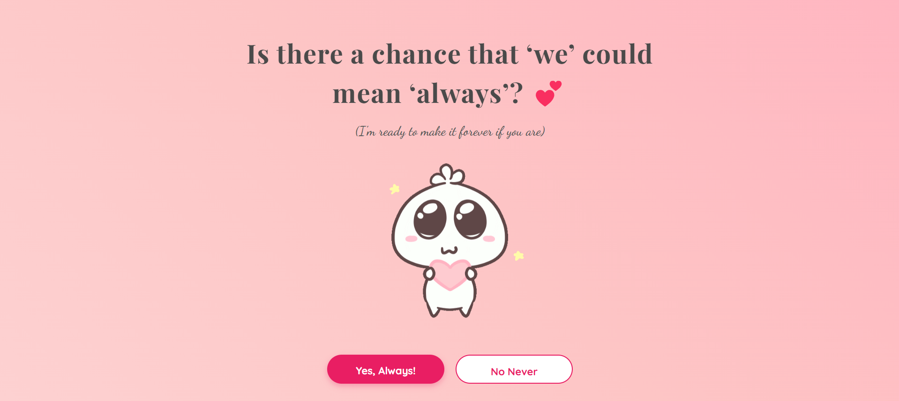

# No Runaway  

No Runaway is a **fun, interactive webpage** where the **"No" button literally runs away** when you try to click it! Designed to bring laughter and frustration (in a good way 😆), this project is all about **fun animations and an engaging UI**.  


## Features  

✅ **Aesthetic Soft Gradient Background** – Because good design matters!  
😂 **"No" Button Moves Away** – The struggle is real!  
🎭 **Humorous & Playful UI** – Perfect for pranking friends!  
🎨 **Smooth Animations** – A seamless and visually pleasing experience  
📱 **Fully Responsive** – Works smoothly on desktops, tablets, and mobiles  

## Preview  

  
***See how it looks like.***

## How It Works  

1️⃣ The page displays a **fun, lighthearted message** along with "Yes" and "No" buttons.  
2️⃣ When the user hovers over the **"No" button**, it **jumps to a random position** on the screen.  
3️⃣ Clicking **"Yes"** triggers a **delightful response** (or maybe an unexpected surprise 😉).  
4️⃣ The background features a **smooth, animated gradient**, enhancing the aesthetic feel.  
5️⃣ The entire layout is **mobile-friendly**, ensuring a seamless experience on any device.  

💡 **Pro Tip:** Try getting someone to click "No"—watch them struggle! 😆  


## Technologies Used  

🔹 **HTML5** – Structuring the fun  
🔹 **CSS3** – Adding style and smooth animations  
🔹 **JavaScript** – Making the "No" button escape!   

## Why This Project?  

- **For Fun!** 😆 This is a simple yet hilarious project that can be shared with friends.  
- **UI/UX Practice** – A great way to experiment with animations and interactivity.  
- **Good for Beginners** – If you're new to HTML, CSS, and JS, this is a great hands-on project!  

## 🤝 Contributing

Contributions are welcome! Follow these steps to contribute:

1. **Fork** the repository.  
2. **Clone** your fork:  
   ```git clone https://github.com/your-username/no-runaway.git```

3. **Create a new branch** for your feature:
```git checkout -b feature-name``

4. **Make your changes** and commit:
```git commit -m "Add new feature"```

5. **Push to your branch** and open a Pull Request:
```git push origin feature-name```

6. Once reviewed, your changes will be merged!
---

**No matter how far you go, you’ll find me waiting.💕**
